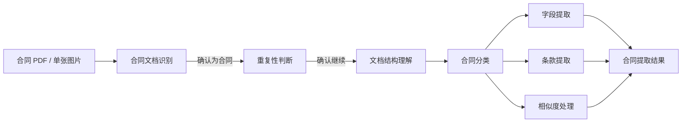

# 合同处理流展示

> 本文说明“处理流”页面当前已经实现的用户可见流程、接口协作和交互边界。后端工作流的精确字段和状态仍以后端接口契约为准。

---

## 页面用途

处理流页面将输入合同、智能体处理过程和提取结果组织在同一张横向流程画布中。用户可以观察服务端实时阶段状态、审核查重候选、查看阶段摘要、对任意可重试的失败阶段执行断点重试，在结果可用后校对 Core 与条款内容，并取消已经取得 `run_id` 的任务。

流程画布采用宽幅布局，为阶段卡片保留足够的文字、进度与计时展示空间。可视区域不足以同时容纳完整流程时，页面保留原始尺寸并支持横向滚动；触控板的横向手势、底部滚动条和普通鼠标滚轮均可移动画布，不通过压缩卡片牺牲可读性。

用户点击输入节点选择本地 PDF 或一张常见图片。图片会先在浏览器内转换为单页 PDF，后续仍按后端规定的原始 PDF 请求体上传，因此不扩展上传契约。首次点击开始提取时，页面先从 `/contract/api/contract/core-definitions` 获取并校验当前进程稳定的 Core 审核定义，建模成功后才通过 `/contract/api/contract/extraction-runs` 创建真实处理任务；定义请求失败或结构无效时不上传 PDF。页面随后使用带鉴权请求头的 Fetch 流式读取 SSE。定义在当前处理流组件生命周期内复用，新任务会重置表单值但保留稳定目录；正式入库接口尚未开放。

页面左上角提供“处理任务”入口。用户打开后，通过 `GET /contract/api/contract/extraction-runs` 读取当前服务进程内可恢复的任务，接口列表状态只消费 `blocked` 和 `processing`：前者置顶归入“需要我处理”，表示自动执行已经停止，需要用户确认查重、重试失败节点、复核结果或继续入库；后者归入“后台处理中”，表示拓扑仍会自动推进，暂时无需操作。两个分区内部保持服务端按 `updated_at` 倒序提供的顺序，卡片展示文件名、粗粒度状态、最近更新时间和到期时间，并标记当前页面正在跟踪的 `run_id`。列表状态仅用于恢复入口，选择任务后仍以单任务快照中的运行状态和七个阶段状态判断具体阻塞位置，并按需恢复 SSE。首次打开和手动刷新时，任务内容保持挂载并由水豚行走动画覆盖，加载层至少展示 1.5 秒后淡出，刷新按钮也至少完成一圈旋转，避免数据切换造成闪动；加载层完全退出后，返回的任务从左侧逐项滑入。面板打开期间每六秒执行一次不打断阅读的静默刷新，任务由 `processing` 转为 `blocked` 时会进入需要处理分区并保留更新渐变。关闭面板后停止请求，列表读取不会刷新任务 TTL。

“处理任务”右侧提供同样式的“新建提取”入口，用于从已选择或已恢复的任务切换到新的空白处理流。切换只停止当前页面的请求和 SSE 订阅，不调用后端取消能力，也不会删除原任务；原任务继续由后台执行并可从任务列表恢复。视觉上先让当前流程画布整体向上移动并淡出，完全退出后清空本地文件、阶段、草稿与滚动位置，再让新的空白画布从底部淡入；切换期间两个入口暂时不可重复触发。

任务卡片同时是处理流恢复入口。点击后，前端先确保 Core 审核定义可用，再以卡片的 `run_id` 获取一次权威快照；成功后清理当前流的网络连接与临时状态，投影七个阶段、查重审核和已有 Core/Clause 草稿，并依据快照状态重新建立 SSE。恢复完成后的自动详情只在需要用户处理的重复性审核和已经可用的合同提取结果之间选择：仍处于查重暂停点时优先打开流程更靠前的重复性判断，否则在 Core 或 Clause 已就绪时打开合同提取结果；其他阶段详情不自动弹出。列表项与快照中的 `run.document` 使用同一结构，用于同步处理版文件名、字节数、页数和封面像素宽高；像素宽高同时决定输入卡片的实际纵横比。快照不返回原 PDF 字节或封面图像，因此恢复其他任务时输入节点仍使用明确的后台任务占位封面，不伪造封面内容。恢复当前页面正在跟踪的同一任务时可以保留已有本地输入封面。

## 用户可见流程

页面只展示业务可理解的子图级阶段，不直接绘制工作流内部的提示词组装、上下文准备和结果合并节点。

`field_subgraph` 作为“字段提取”阶段展示，其内部一对一嵌套的 Core 提取子图不再重复绘制。隐藏技术节点产生的状态和错误应聚合到对应的用户阶段，不能被静默忽略。

图片转 PDF 属于输入节点内部的前端归一化步骤，不作为后端工作流阶段单独绘制。只有转换成功生成 PDF 后，文件下方的提取按钮才会启用。

## 状态与结果更新

节点支持等待、处理中、重试中、成功和失败状态；节点连线同步表达处理方向和状态。点击输入、处理阶段和输出节点分别打开文件信息、阶段详情和结果校对面板。

合同分类、字段提取、条款提取和相似度处理使用后端真实离散进度。`progress` 为 `null` 时只展示阶段状态和说明，不渲染推测性的进度条；获得具体总量后才展示进度条和 `completed / total`。合同文档识别、重复性判断、文档结构理解等没有离散子进度的节点始终不显示内部进度条。离散进度变化通过平滑插值推进，处理中在已完成区域显示流动高光；进度达到总量但阶段仍为处理中时，卡片显示满进度收尾动画。只有阶段状态明确成功后才转为完成并点亮成功连线。

合同文档识别是任务创建后的首个服务端阶段。可靠确认为合同时，服务自动开始重复性判断；可靠判定为非合同时，页面停在该节点，展示 `document_detection` 中的判断理由和逐页证据，查重及后续阶段保持等待。技术失败按阶段失败展示，不能伪装为非合同结论。

查重完成时，处理流暂停并展示最多三份候选合同、相似度、关系和审核理由。候选以审核档案卡片呈现：文件身份与关系优先展示，相似度使用数值和进度轨道共同表达，判断依据与预览动作保持独立层级；重复、相似、不同和判断失败使用低饱和的关系色区分。收到查重结果时只保存候选元数据，不预取任何 PDF。候选的友好名称与 `file_uri` 直接使用服务端结果；只有用户点击对应的“预览候选 PDF”后，才将 `file_uri` 作为查询参数传给 `/contract/api/resource/contract`，携带 Bearer 鉴权读取二进制并生成浏览器 Blob URL，再复用合同库的全屏磨砂 PDF 查看器展示。免登码不会进入 iframe 地址，关闭预览时释放临时 Blob URL。预览期间暂停分子背景，关闭后恢复。用户确认后调用继续接口，文档结构理解随即开始，之后进入合同分类与三个并行分支。

字段提取、条款提取和相似度处理是三个并行阶段。Core 或 Clause 任一分支形成结果后，输出节点立即进入可用状态并展示当前快照中的已有审核分区，不等待其他路径全部完成；相似度处理只参与整体运行状态，单独成功不会开放空白结果面板。七个业务阶段均严格依据服务端 `failed` 与 `retryable` 状态提供断点重试；成功阶段不允许重复执行。重试复用此前已经成功的权威结果，不在前端回退或重跑更早阶段；目标成功后继续消费后续 SSE，并以服务端新结果更新对应审核内容。

合同分类成功事件携带的 `classification` 会立即展示在合同分类节点详情；分类成功后的权威快照也会在 `run.classification` 持续返回同一精简结构，因此任务恢复、断线恢复和草稿刷新都能重建分类详情。该结果不写入最终审核草稿。`classified` 按服务端顺序展示一项或多项类别名称、稳定编码和业务场景；`unmapped` 展示未映射类型说明；`partial` 可以同时展示已命中类别与补充类型说明。分类详情不推测或展示未公开的证据、失败类别及工具轨迹。

阶段卡片不再显示左上角的技术分类标签。状态胶囊固定在右上角，主图标占据左上区域，任务名称、过程提示和可用进度依次向下排列，避免单独状态行造成空旷。主图标直接表达等待、进行、完成状态：重复性判断进行时使用放大镜往复扫描双行内容的专属动画；文档结构理解进行时使用紫蓝色文档逐页翻动动画；合同分类进行时展示文档从左侧内容堆进入语义扫描核心，并沿三条路线依次落入不同色彩分类槽的分拣动画。专属动画出现时由轻微模糊状态淡入，结束时先淡出，完全退场后再播放成功或失败图标。其余节点进行中和重试中使用立方体翻转动画；完成状态使用圆形弹出、对勾轨迹绘制和轻微余波组成的一次性成功动画；失败状态使用红色圆形弹出、叉号分笔绘制、轻微受阻回摆和余波组成的一次性失败动画。阶段成功或失败后，卡片隐藏标题下方的过程提示，详细消息仍可在阶段详情中查看。

结果校对区只消费快照顶层 `draft.core` 和 `draft.clauses`，不读取或展示分类、检索问题、向量、文档元数据、证据、推理与内部状态。Core 审核区以定义接口的稳定顺序和字段 `code` 为内部骨架，直接按同名键合并 `draft.core` 的标量、对象或对象数组；界面中的每个 Core 字段只使用定义中的中文名称作为唯一标题，不向审核用户展示英文稳定编码。提取值为 `null`、Core 尚未就绪或某字段没有可靠值时，表单结构仍然完整。`single` 字段在标题下直接提供输入控件，不渲染成列表对象；单属性时不重复显示属性名称，必填和修改状态合并到唯一标题。`multiple` 字段继续以带序号的多项列表呈现，并允许用户新增和移除条目；每项使用独立稳定身份，新增时随占用空间展开并淡入，移除时先收拢再释放空间，操作不会触发结果弹窗关闭。属性类型分别映射为文本、整数、数值或布尔控件。Clause 直接使用 `draft.clauses` 中的条款标题、页码与正文；每条条款只展示一个标题，优先使用 `title`，缺失时依次回退到 `identifier` 和条款序号，不重复渲染层级路径。条款正文默认通过项目统一的安全 Markdown 组件渲染，支持标题、列表、引用、链接、代码块和表格等常用语法，并可在原始 Markdown 编辑与格式化预览间切换；原始 HTML 不执行。页面不再兼容旧的嵌套草稿结构。

最终结果弹窗使用低饱和香槟金表单语言：外壳以细颗粒双层渐变和内外阴影呈现金属厚度，审核分区使用轻微浮起层，输入、选择和条款编辑控件使用内嵌槽与聚焦下压反馈。数值字段使用较短的输入区，并在右外侧提供独立的减、加按键；两枚按键嵌入同一固定凹槽底座，圆形按帽在静止时微微浮起、按下时单独沉入底座。布尔字段默认收拢为单行当前值，点击后以不参与容器布局的浮层向下展开“未选择、是、否”玻璃选项，滑块先移动到新选项后再自动收起。文本字段仍占满整行。必填空值不使用单侧阴影，而以沿圆角边缘循环的紫粉色跑马灯提示；系统启用“减少动态效果”时退化为同色静态描边。条款 Markdown 预览保留浅色纸面对比，避免金属背景削弱长文可读性；当前未开放的入库按钮只保留同系视觉，仍明确为禁用状态。

页面将用户编辑值保存在独立审核模型中并标记修改，后续 SSE 触发快照刷新时不会直接覆盖这些本地修改。模型内部统一按字段与属性 `code` 寻址，未来提交时可按定义的 `cardinality` 恢复标量、对象或对象数组结构。由于专家编辑和最终确认接口尚未开放，入库操作保持禁用。

“结果可查看”和“允许正式入库”是不同状态。正式接入时，是否允许部分结果入库应以后端业务规则为准。

## 当前交互

- 页面进入后等待用户点击输入节点并选择 PDF，或选择一张 PNG、JPG、WEBP、GIF、BMP、AVIF 图片，不会自动播放处理过程。输入节点始终使用同一套上传卡片：未选择文件时，上方是带云端上传图标的虚线浏览区域，下方是当前文件状态栏；悬停时整卡轻微抬升，上传图标同步上移并增强投影。文件就绪后不切换回旧纸张模板，而是在同一卡片的上区展示封面，底部只保留居中的清除按钮，不再展示左侧文件图标或卡片内改名框；上区及卡片宽度根据封面真实长宽比平滑适配，底部文件栏保持固定高度。提取开始前，文件名只在点击封面后的文件详情中编辑，非空且不超过 255 个字符，并作为创建任务的 `file_name` 提交；开始处理后名称锁定。恢复任务也复用同一卡片，以后台占位封面替代不存在的本地图像。
- 左上角“处理任务”和“新建提取”各自拥有一块与工作台表面连续的独立弧形基座，两个基座之间明确断开。按钮通过实体厚边、内侧高光和曲面渐变分别从各自基座中隆起，不表现为普通悬浮卡片；按下时只让对应按钮本体下沉，基座保持不动，松手后立即弹回且不随面板保持按下。任务数量为零时数字完全收起；数量出现或位数变化时，按钮先按实际位数平滑增长宽度，每一位数字再通过独立纵向滚轮完成至少一圈滚动并落到目标值，不使用单个文本的跳变。数量不使用圆形或胶囊背景，也不限制展示位数，多位数字可以按内容自然扩展。任务面板首次打开时执行一次带水豚动画的前台同步，成功后在页面存活期间持续以后台轮询更新缓存，后续打开面板直接渲染已有条目，不再用全屏加载层遮挡。轮询返回新任务时，新条目从左侧淡入并自动补位；已有任务仅状态或时间发生变化时，保持原卡片并播放一次轻量渐变扫光。任务条目采用轻量合同档案卡片，以文件名和状态为主层级，更新时间与保留时间为辅助信息，不向用户暴露内部任务编号。底部状态光轨只区分仍在自动推进的 `processing` 与等待人工介入的 `blocked`，不将运行状态伪装成定量进度。当前页面选中的任务以沿圆角边缘持续行进的跑马灯高光标识；切换任务时，高光优先跟随正在恢复的目标，恢复完成后再保持在新的当前任务上，避免同时高亮两个任务。任务卡片支持鼠标与键盘激活，恢复期间展示同步状态，成功后关闭任务面板并回到权威处理流；恢复失败保留面板和对应卡片错误信息。点击外部区域或按下 `Escape` 可关闭面板。
- PDF 使用预热的 PDF.js 读取真实页数和第一页视口，并将封面绘制到 Canvas。图片先在白底 Canvas 中按原比例合成，最大边限制为 4096 像素，再压缩并封装为单页 PDF；透明区域会转为白色，动态图使用浏览器解码到的单帧内容。
- 尺寸读取和封面绘制期间使用白色骨架层，避免黑屏闪烁。左上角徽标识别原始输入格式；图片采用独立配色，详情面板明确展示“已生成单页 PDF”。
- 选择有效文件后会打开文件详情弹窗并先展示读取状态。弹窗顶部始终保留同一个固定高度的文件名输入区：主文件名在提取前可直接修改，`.pdf` 后缀作为独立的固定区域始终存在且不可编辑；开始提取或恢复后整个文件名只在原位切换为只读锁定态，不卸载节点或改变后续内容高度。内部和创建任务请求统一使用完整的 `<主文件名>.pdf`，主文件名为空时不允许开始提取。未选择文件、封面尚未完成绘制或封面尺寸仍在过渡时同样不允许开始提取；Canvas 绘制、骨架淡出和宽高尺寸动画全部结束后，黑色 AI 提取按钮及芯片线路装饰在文件详情弹窗内渐显。点击后先准备 Core 审核定义，再以 PDF 二进制和用户确认的文件名创建真实任务；Core 定义请求和创建请求尚未返回 `run_id` 时，按钮只展示当前创建步骤并保持不可取消。文件详情弹窗不再提供重复的“重新上传 PDF”按钮，替换操作统一通过上传卡片底部的删除入口完成；已有运行、取消请求和回退期间禁止清除输入文件。
- 创建响应返回 `run_id` 后，文件详情中的控制按钮切换为真实“取消任务”入口；正在自动处理、等待查重、失败阻塞和已经形成草稿的当前任务均可取消，从任务列表恢复的任务也使用相同行为。点击后调用 `DELETE /contract/api/contract/extraction-runs/{run_id}`，取消期间锁定任务切换与重复提交；收到 `204` 或当前 SSE 的 `run.cancelled` 后停止订阅、从任务列表缓存移除该运行、清除已失效草稿，并按拓扑逆向播放回退动画。取消不可恢复：保有浏览器本地原文件时，回退后可使用该文件重新创建任务；恢复任务没有本地原文件，回退结束后返回空上传位。`404` 会将当前运行标记为不可用并提示任务不存在、已结束或无权取消，其他请求错误保留当前任务供用户重试。
- 每个阶段以服务端快照中的 `started_at` 为本次尝试起点：运行或重试中的卡片右下角实时显示“已处理”时长，成功或失败后以 `updated_at - started_at` 冻结并显示本次耗时，均以秒为单位保留两位小数。恢复后台任务时直接从权威时间戳还原，不从页面重连时刻重新起算；兼容不含 `started_at` 的旧响应时才回退为本地计时。
- 取消成功后的回退先从输出端撤回并行路径，再依次退回合同分类、文档结构理解、重复性判断和合同文档识别，最终回到 PDF 输入节点。回退期间按钮不可操作，只有动画完全抵达输入节点后才能重新创建任务。
- 点击已选择的文件封面可以打开文件详情，查看文件类型、大小、页数和封面尺寸；详情中可以重新选择文件，不再提供启动处理或原文件预览入口。
- 点击任意处理阶段可以查看进度、耗时和处理摘要；合同分类成功后，其节点详情展示 SSE 事件或恢复快照返回的类别、编码、场景和未映射说明。
- 重复性判断、合同分类和合同提取结果使用加宽详情面板，并提升标题、说明、候选信息、分类结果和审核表单字号；面板宽度仍受工作台可用空间限制，小尺寸窗口不会横向溢出。
- SSE 使用 Fetch 流式客户端携带 `Authorization`，记录最后处理的事件序号；断线后先获取权威快照，再携带 `Last-Event-ID` 恢复订阅。心跳不刷新草稿。
- `run.document_rejected` 会打开合同文档识别详情并停止后续等待；断线时通过快照中的 `not_a_contract` 与 `document_detection` 恢复相同行为。
- 查重审核事件会自动打开候选面板；断线漏掉事件时，通过快照中的运行状态和查重结果恢复该面板。如果事件到达时正在查看其他弹窗，旧弹窗先以右侧为锚点缩回，完整退出后再进入查重面板；如果已经打开查重面板，则保留外壳，仅让旧候选内容淡出并以新结果淡入。用户关闭后再次点击重复性判断节点仍会打开同一候选面板，不重新请求或丢弃候选；确认继续后进入文档结构理解，之后仍可回看候选，但不会再次出现继续按钮。
- 合同文档识别、重复性判断、文档结构理解、合同分类、Core、条款和相似度处理七个阶段均依据服务端 `retryable` 状态提供单独重试；前端不自行推断尝试上限。
- 收到 `draft.updated` 或 `run.review_ready` 后重新读取权威快照；只有 `run.available_sections` 出现 `core` 或 `clause`，或者快照实际包含对应结果时，输出节点才可打开。相似度处理单独成功不会开放结果面板。
- 输出卡片只展示结果状态以及字段、条款数量，不展示主图标、右上角版本提示或问题数量。
- 结果面板支持校对服务端快照中的可编辑内容；入库接口未开放前不构造临时写入请求。
- 详情弹窗打开时不锁定工作台：点击不属于当前详情的输入、阶段或结果卡片时，旧弹窗先完整向右退场，退场结束后目标弹窗才从右侧进入；重复点击当前卡片不重播动画，连续快速点击时只展示最后一次选择。后端主动触发的非合同判断和查重审核也遵循同一切换顺序。弹窗本身始终停留在标准位置；如果它占用了右侧可视区域，且处理流原有滚动上限不足以把最右侧卡片完整移动到弹窗左侧，视口会按实际缺口增加右侧滚动余量。关闭弹窗后这段余量平滑收回。在文件详情打开时点击上传卡片底部的删除按钮，会立即清空文件并收起弹窗。点击非交互空白区域或按下 `Escape` 仍会关闭当前详情。弹窗保持打开时，在外部透明区域使用鼠标滚轮或触控板仍可横向浏览处理流，滚动位移即时跟随手势，不叠加程序化平滑滚动，且滚动手势本身不会关闭弹窗。

## 验证范围

- 在实际工作台尺寸下检查流程图、放大后的阶段卡片、横向滚动、PDF 或图片归一化后的封面、并行连线和输出节点布局。
- 验证真实上传响应能够初始化首个合同文档识别阶段，并且 SSE 状态、离散进度和计时正确投影到节点。
- 验证任务列表按钮按需请求真实列表、只接受 `blocked` 和 `processing`、将需人工介入与后台自动处理任务正确分区，并正确处理空列表和请求失败；验证打开期间定时刷新、状态变化时跨分区更新且关闭后停止，列表读取不刷新服务端 TTL。分别点击其他任务与当前任务，验证先获取 Core 定义和权威快照、正确重建阶段及结果、同步 `document` 文件名、处理版大小、页数和封面像素尺寸、按运行状态恢复 SSE，并确认恢复任务只更新占位封面的比例而不虚构封面图像，失败时不破坏当前处理流。选中本地文件、后台运行任务和阻塞任务后分别点击“新建提取”，确认旧画布先向上淡出、新画布后从底部淡入，本地输入与滚动位置被清空，而后端任务仍可从列表恢复。
- 验证 Core 定义请求严格发生在任务创建请求之前；定义失败时不创建任务，成功后按服务端顺序建立完整表单，并在同一组件生命周期内复用定义。
- 验证顶层 `draft.core` 中的 `single` 单属性标量、`single` 多属性对象、`multiple` 对象数组和 `null` 都能按字段 `code` 正确绑定；数字、布尔和必填属性使用相应控件，多项条目可增删。验证顶层 `draft.clauses` 使用新的条款字段渲染，旧分类、检索、证据及推理字段不再被前端消费。
- 分别验证合同结论自动进入查重，以及非合同结论展示证据并保持所有后续阶段不启动。
- 验证查重暂停、候选鉴权预览、确认继续、七阶段失败断点重试和断线恢复；两处 PDF 入口使用同一查看器样式，预览开关能正确暂停并恢复分子背景。
- 验证 Core 定义准备和任务创建期间取消按钮不可用；创建响应取得 `run_id` 后，分别从自动处理、查重等待、失败阻塞和结果已形成状态执行取消，确认只发送一次 `DELETE`、正确处理 `204` 与先到达的 `run.cancelled`、从任务列表移除运行并完成逆向回退。验证本地上传任务保留原文件供重新处理，恢复任务回退后清空占位输入；验证 `404` 与普通网络失败不会伪装成取消成功。
- 验证 Core 或 Clause 首次可用时输出由等待变为可查看，后续结果更新不会覆盖用户已经修改的字段；仅相似度处理成功时输出仍保持不可打开。
- 验证合同分类的 `classified`、`unmapped` 和 `partial` 三种结果均可在分类节点详情正确呈现，多类别保持服务端顺序；分别通过实时 SSE、断线快照和任务恢复快照进入页面，确认 `run.classification` 能重建相同结果。
- 验证 PDF 保留实际页数；分别验证常见图片能够生成可被 PDF.js 读取的单页 PDF，并保持原始长宽比。
- 验证不受支持或无法解码的文件不会启用“开始提取”，并展示明确失败提示。
- 验证选择文件后自动打开文件详情弹窗，封面能够在统一上传卡片中绘制并按真实比例调整，骨架淡出和尺寸过渡完成前不允许开始提取，完成后 AI 提取按钮在弹窗内缓慢渐显。从详情弹窗修改文件名，确认空名称禁用提取、创建请求使用用户确认的名称；点击开始后名称锁定、弹窗不关闭且按钮切换为停止入口。确认详情中不存在重复上传按钮，卡片底部只有居中的删除入口，可以清除并重新选择文件，运行、上传请求和回退期间不能清除。节点计时从运行状态响应开始并保留两位小数；运行中停止后，计时随对应回退阶段淡出，且只有完全回到 PDF 输入节点后才能从头重新提取。
- 验证登录失效时清除本地会话并返回登录页。
- 执行项目生产构建。
